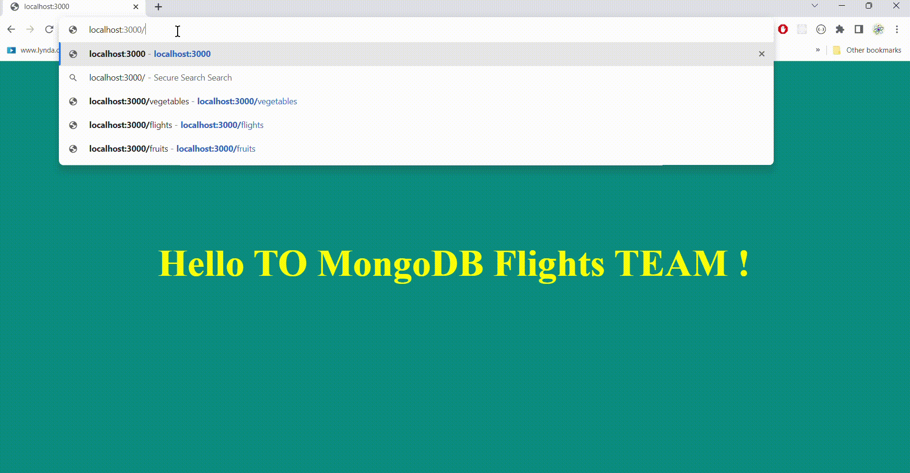

<h1>MongoDB Express Flights Project</h1>

<h4>Exercises</h4>
Create a new folder for this lab called mongoose-flightsand initialize a git repo inside of it
Create a seperate remote for this repo on Github to push your commits for this assignment; you will need to send us a URL to your remote when you're ready to turn this assignment in for feedback
Create your package.jsonand server.js
Create all your basic folders to get started; just as we've done with every express projects ... i.e. models, routes, controllers, and views-- prepare to create additional files (modules) inside of these folders
Create a config/database.js module inside your project that connects to a database named flights-- Be sure to require the module in server.js
Create a FlightModel with the following properties:

<h4>Property Type Validations Default Value</h4>
<ul>
<li>airline String enumto include 'American', 'Southwest' & 'United' n/a</li>
<li>flightNo Number Required</li>
<li>Between 10and 9999 n/a</li>
<li>departs Date n/a One year from date created</li>
</ul>

Implement the following User Stories ("As A User" == AAU):
<ul>
AAU, I want to view a list of all flights (index view) that displays each flight's airline, flight no., and departure date/time
AAU, I want to create flights by entering the information on a page (new view) that has a form and submitting it
</ul>
